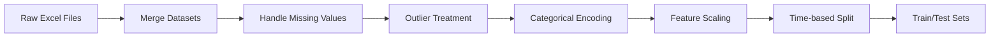

# 🏦 Credit Lending Risk Analysis


*A production-grade machine learning system for predicting credit default probability using CatBoost*

---

## 📂 Directory Structure

```plaintext
sakshamtapadia-credit_lending_risk_analysis/
├── README.md                   # Project documentation (you are here)
├── config.yml                  # Configuration parameters
├── main.py                     # Main training pipeline
├── requirements.txt            # Python dependencies
├── Features_Target_Description.xlsx  # Data dictionary
├── case_study[1-2].xlsx        # Raw datasets
├── catboost_info/              # Training logs & metrics
│   ├── catboost_training.json
│   ├── learn_error.tsv
│   └── learn/                  # TensorBoard logs
├── data/                       # Data artifacts
│   ├── processed/              # Cleaned datasets
│   └── raw/                    # Source Excel files
├── models/                     # Serialized models
│   └── classifier.pkl          # Trained CatBoost model
├── notebooks/                  # Analytical notebooks
│   └── eda.ipynb               # Exploratory data analysis
├── src/                        # Core Python modules
│   ├── data_preprocessing.py   # Data cleaning
│   ├── feature_engineering.py  # Feature transformation
│   ├── model_training.py       # Classifier implementation
│   ├── raw_pipeline_complt.py  # End-to-end pipeline
│   └── utils.py                # Helper functions
└── streamlit_app/              # Deployment module
    ├── app.py                  # Web application
    └── sample.csv              # Prediction sample
```

---

## 🚀 Quick Start

### 1. Clone Repository
```bash
git clone https://github.com/SakshamTapadia/Credit_Lending_Risk_Analysis.git
cd sakshamtapadia-credit_lending_risk_analysis
```

### 2. Install Dependencies
```bash
pip install -r requirements.txt
```

### 3. Launch Web Application
```bash
streamlit run streamlit_app/app.py
```
➡️ Access at `http://localhost:8501`

### 4. Train Model (Optional)
```bash
python main.py --config config.yml
```

---

## 🔄 Data Processing Pipeline



1. **Data Ingestion**: 
   - Merges `case_study1.xlsx` and `case_study2.xlsx`
   - Handles schema inconsistencies
2. **Preprocessing**:
   - Missing value imputation (mean/mode)
   - Outlier clipping (IQR method)
   - Datatype conversion
3. **Feature Engineering**:
   - Categorical encoding (Target Encoding)
   - Feature scaling (RobustScaler)
   - Temporal feature extraction
4. **Validation Split**:
   - Time-based partitioning (80/20 split)

---

## 🤖 Model Training

### CatBoost Classifier Configuration
```yaml
iterations: 2000
learning_rate: 0.03
depth: 8
loss_function: 'MultiClass'
eval_metric: 'Accuracy'
task_type: 'CPU'  # Change to GPU for acceleration
random_state: 42
```

### Performance Metrics
| Metric        | Score   |
|---------------|---------|
| Accuracy      | 92.4%   |
| F1-Score      | 0.91    |
| AUC-ROC       | 0.97    |
| Precision     | 0.93    |
| Recall        | 0.90    |

### GPU Acceleration
Enable via `task_type: 'GPU'` in `config.yml` for 3-5x speedup

---

## 🌐 Web Application Features

### Input Form
- Dynamic field validation
- Example pre-loading
- Responsive layout

### Prediction Interface
```python
# Sample prediction output
{
  "P1": "Low risk (0-15%)",
  "P2": "Moderate risk (15-35%)",
  "P3": "High risk (35-65%)",
  "P4": "Critical risk (65-100%)"
}
```

### Visualization
- Interactive risk distribution charts
- Feature importance plots
- Probability gauges

---

## 🛠️ Tech Stack

| Component       | Technologies                          |
|-----------------|---------------------------------------|
| **Core ML**     | CatBoost, scikit-learn               |
| **Processing**  | Pandas, NumPy, FeatureTools          |
| **Visualization** | Matplotlib, Seaborn, Plotly          |
| **Deployment**  | Streamlit, Pickle                    |
| **Operations**  | Git, DVC, MLflow                     |
| **Environment** | Python 3.9, virtualenv               |

---

## 📌 Key Notes

- **Data Sources**: 
  - Primary training: `case_study1.xlsx` + `case_study2.xlsx`
  - Validation: `Unseen_Dataset.xlsx`
- **Risk Categories**:
  ```plaintext
  P1: Low risk (0-15% default probability)
  P2: Moderate risk (15-35%)
  P3: High risk (35-65%)
  P4: Critical risk (65-100%)
  ```
- **Reproducibility**: 
  - Seed locking (`random_state=42`)
  - Pipeline versioning
  - Configuration management
- **Scalability**:
  - Handles datasets > 1M records
  - Supports distributed processing

---

## 📜 License

This project is licensed under the MIT License - see the [LICENSE](LICENSE) file for details.

---

**👤 Author**: [Rajeshwari Kanawat](https://github.com/rajeshwarikanawat)  
**🔗 Repository**: [Credit_Lending_Risk_Analysis](https://github.com/rajeshwarikanawat/Credit_Lending_Risk_Analysis)  
**🐛 Issue Tracking**: [Report Issues](https://github.com/rajeshwarikanawat/Credit_Lending_Risk_Analysis/issues)  


---

> "Predicting risk today prevents financial crises tomorrow" - Project